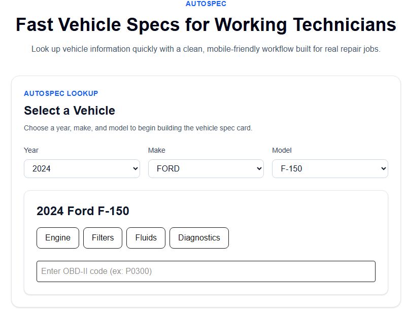
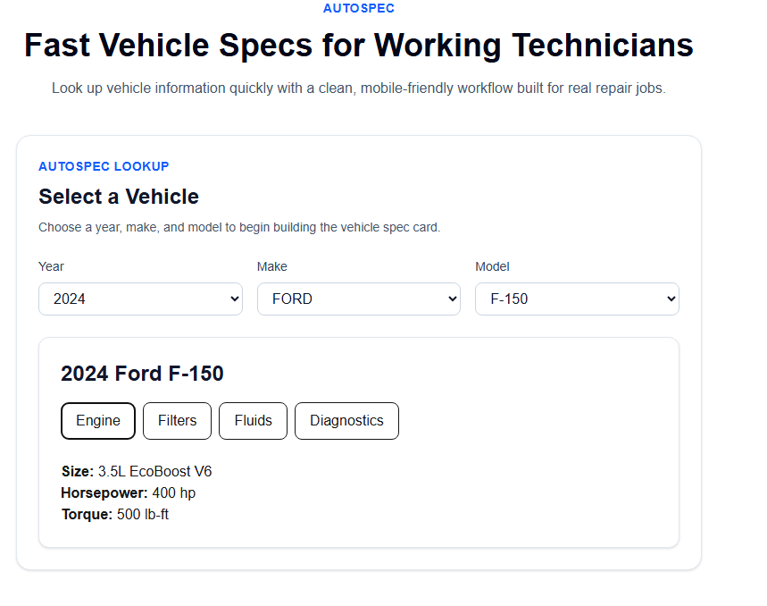
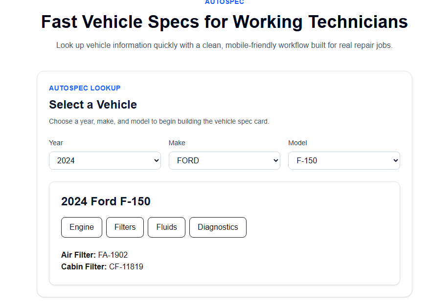
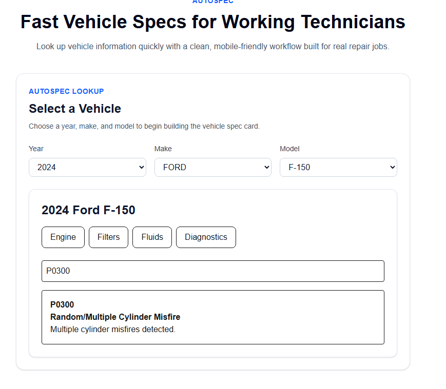

# AutoSpec

AutoSpec is a professional vehicle service workflow application built with React and Next.js. It helps technicians and service teams move from vehicle identification to actionable service information with fewer clicks and better in-bay efficiency.

## Project Overview

AutoSpec combines key automotive workflow steps into one interface:

- Vehicle lookup by year, make, and model
- Vehicle specification display (engine, filters, fluids)
- OBD-II diagnostic code lookup
- Job notes capture with local persistence
- Parts checklist tracking with completion controls

The application is optimized for real-world service usage, with a clean UI, responsive layout, and accessible form controls.

## Problem Statement

Technicians often switch between multiple systems or tabs to gather vehicle specs, diagnostic references, notes, and required parts. This context switching increases time-to-service, introduces avoidable errors, and slows shop throughput.

AutoSpec addresses this by centralizing essential reference and workflow tooling into one focused interface.

## Features

- Dynamic Year → Make → Model selection workflow
- NHTSA-powered vehicle make/model data integration
- Vehicle specification tabs (engine, filters, fluids, diagnostics)
- OBD-II code search with code details
- Job Notes component with localStorage persistence
- Parts Checklist component with:
	- Add and complete item workflows
	- Clear Completed and Clear All actions
	- localStorage persistence and reload-on-mount behavior
- Responsive Tailwind CSS interface
- Accessibility improvements including explicit labels for form controls

## Tech Stack

- Next.js (App Router)
- React
- TypeScript
- Tailwind CSS
- TanStack Query (React Query)
- Jest
- React Testing Library
- ESLint

## Installation

### Prerequisites

- Node.js 18+
- npm 9+

### Setup

```bash
git clone <your-repository-url>
cd autospec
npm install
```

## Running Locally

Start the development server:

```bash
npm run dev
```

Open http://localhost:3000 in your browser.

Create a production build:

```bash
npm run build
```

Run the production server:

```bash
npm run start
```

## Testing

Run all tests:

```bash
npm test
```

Run a specific test file:

```bash
npm test -- src/components/__tests__/PartsChecklist.test.tsx
```

Run lint checks:

```bash
npm run lint
```

## Deployment

AutoSpec is ready to deploy on platforms that support Next.js applications.

### Recommended: Vercel

1. Push this repository to GitHub.
2. Import the project into Vercel.
3. Use default build settings for Next.js.
4. Deploy.

### Manual Deployment

For self-hosting, build and run the app:

```bash
npm run build
npm run start
```

## Future Enhancements

- Maintenance interval scheduling by mileage/time
- Expanded OBD-II and manufacturer-specific diagnostics
- Vehicle recall and TSB integration
- Service history snapshots and printable job reports
- Role-based workflows for technicians, advisors, and managers
- Cloud sync for notes and parts checklists

## Screenshots

### Vehicle Selector



### Engine Specifications



### Filter Information



### Fluid Specifications


### OBD-II Diagnostic Lookup



## Project Walkthrough

Watch the Loom demo:
[AutoSpec Demo] https://www.loom.com/share/611385ccb4a74e93adebc39c1df690d1